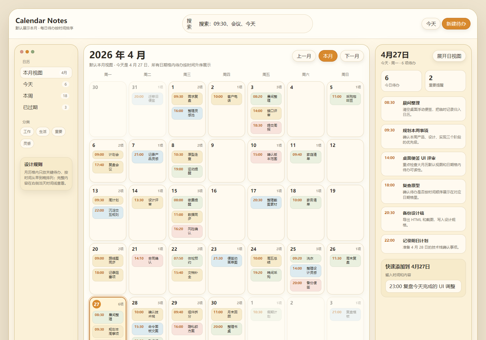

# Calendar Notes

一个桌面端日历便签应用：以大月历为中心展示本月安排，支持本地待办、提醒、农历/节假日信息，并可在 Windows 上通过经典 Outlook + COM 只读同步默认日历。

> 截图中的日程与待办均为演示数据，不包含真实日历内容。



## 功能特点

- **大月历视图**：默认展示本月，日期格内按时间顺序显示当天待办与日程。
- **本地便签待办**：支持标题、正文、颜色分类、完成状态与提醒时间。
- **提醒通知**：到点后若待办未完成，会弹出应用内提醒，并尝试发送系统桌面通知。
- **农历与节假日**：在日历格内展示农历、法定节假日和调休工作日信息。
- **Outlook 只读同步**：通过经典 Outlook + COM 读取本机默认日历快照，不写回 Outlook。
- **隐私优先**：默认不展示私密日程正文和真实标题，SQLite 不保存 Microsoft refresh token。

## 技术栈

- Tauri v2
- React 19 + TypeScript + Vite
- Rust 后端命令
- SQLite 本地缓存
- lunar-javascript 农历信息

## 本地开发

```powershell
npm install
npm run dev
```

构建前端：

```powershell
npm run build
```

检查 Tauri/Rust：

```powershell
cargo check --manifest-path src-tauri/Cargo.toml
```

构建桌面应用：

```powershell
npm run tauri -- build
```

## Outlook 同步说明

当前同步方案面向 Windows 桌面环境，依赖本机已安装并登录的经典 Outlook 客户端：

- 读取范围：当前月前后各 1 个月。
- 读取方式：Outlook Object Model / COM 本地快照。
- 安全策略：只读同步，不创建、不修改、不删除 Outlook 日程。
- 兼容限制：新版 Outlook 不支持 COM Object Model，因此需要经典 Outlook。

如需允许同步私密日程的完整详情，可自行设置环境变量：

```powershell
[Environment]::SetEnvironmentVariable("CALENDAR_NOTES_OUTLOOK_COM_INCLUDE_PRIVATE_DETAILS", "true", "User")
```

## 页面截图

截图文件位于 `docs/assets/calendar-notes-demo.png`，由 `design/desktop-notes-ui.html` 的静态演示页生成，内容为公开可展示的假数据。

## 产物位置

桌面应用构建完成后，常见产物位于：

- `src-tauri/target/release/calendar-notes.exe`
- `src-tauri/target/release/bundle/msi/Calendar Notes_0.1.0_x64_en-US.msi`
- `src-tauri/target/release/bundle/nsis/Calendar Notes_0.1.0_x64-setup.exe`

## 参考资料

- [Outlook Object Model AppointmentItem](https://learn.microsoft.com/en-us/office/vba/api/outlook.appointmentitem)
- [Outlook Items.IncludeRecurrences](https://learn.microsoft.com/en-us/office/vba/api/outlook.items.includerecurrences)