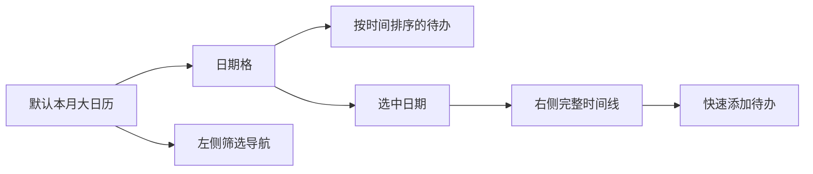

# 桌面便签应用 UI 设计规格

## 1. 设计目标

这是一款面向桌面端的日历便签应用，核心体验是“随手记录、按日期回看、轻量整理”。默认界面应优先展示本月大日历，让用户一打开应用就能看到每天有哪些待办，以及它们在当天的时间顺序。

## 2. 美学方向

- **关键词**：温暖纸感、原生桌面、轻量秩序、安静陪伴。
- **避免**：强科技感渐变、紫色 AI 风、过度玻璃拟态、过多发光效果、花哨动效。
- **视觉隐喻**：纸张、软阴影、日期贴纸、轻量工具条、桌面便签层叠。

## 3. 色彩系统

| Token | 值 | 用途 |
| --- | --- | --- |
| `--paper` | `#F7EBCB` | 默认便签纸面、工作待办 |
| `--paper-soft` | `#FFF8E8` | 主背景、面板底色 |
| `--ink` | `#2D2A24` | 主文本 |
| `--muted` | `#756F64` | 次级文本 |
| `--amber` | `#D8892D` | 当前日期、主按钮、时间强调 |
| `--sage` | `#8FA77A` | 生活类待办、完成状态 |
| `--rose` | `#D89485` | 重要提醒、风险项 |
| `--line` | `#E3D6B8` | 分割线、边框 |
| `--shadow` | `rgba(78, 56, 28, 0.18)` | 卡片阴影 |

## 4. 字体与排版

- 中文优先：`LXGW WenKai`, `Noto Serif SC`, `Microsoft YaHei UI`。
- 月份标题：28–32px，强化“当前月份”识别。
- 日期数字：14–16px，当前日期可使用圆形色块突出。
- 待办正文：11–12px，日期格内限制两行以内。
- 日期与时间：使用等宽数字或 `font-variant-numeric: tabular-nums`。

## 5. 核心界面形态

### 5.1 默认大月历

- 应用默认进入“大月历”视图，展示当前月份完整周网格。
- 周从周一开始，补齐上月/下月相邻日期，帮助用户理解连续时间。
- 当前日期使用琥珀描边和浅纸色强调。

### 5.2 日期格内待办

- 每个日期格就是当天的时间框，待办直接嵌入格内。
- 待办必须按照 `HH:mm` 从早到晚排序。
- 日期格内最多展示 3–4 条关键待办，超出时用“+N 项”提示，避免月视图拥挤。
- 待办根据分类使用纸条色：工作、生活、重要、灵感。

### 5.3 当日详情栏

- 右侧展示当前选中日期的完整时间线。
- 被月历格折叠的待办在详情栏完整展示。
- 支持快速添加到选中日期，输入格式优先为“时间 + 内容”。

### 5.4 侧边导航

- 左侧保留本月、今天、本周、已过期等入口。
- 分类筛选使用标签样式，不抢占大月历主视觉。

## 6. 组件规则

- 所有图标按钮或短文本按钮必须有清晰可访问名称。
- 日期格使用原生 `button`，方便键盘选择日期。
- 焦点态使用 2px 琥珀描边，不能移除轮廓。
- 动效只用于 `transform` 和 `opacity`，交互反馈不超过 160ms。
- 每个空日期格保持安静，不展示无意义占位文案。

## 7. 信息架构

## 8. 原型交付

- 静态高保真原型：`design/desktop-notes-ui.html`
- 渲染截图：`output/ui/desktop-notes-ui-overview.png`
- 覆盖形态：默认大月历、按时间排序的日期待办、当日详情、快速新建、设置入口。
- 适合下一步拆分为 Electron/Tauri/React 组件。

